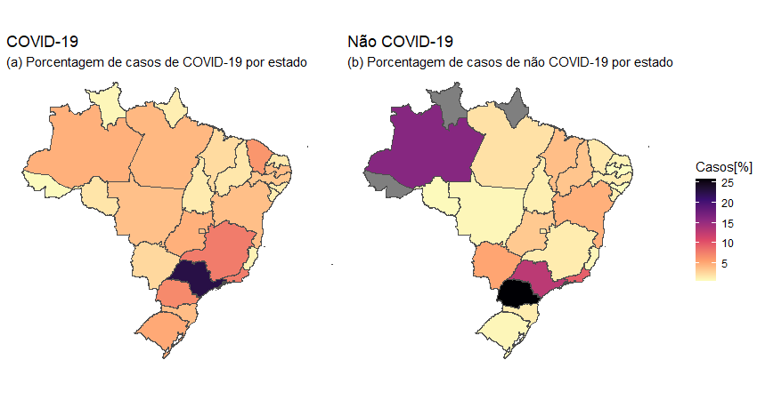
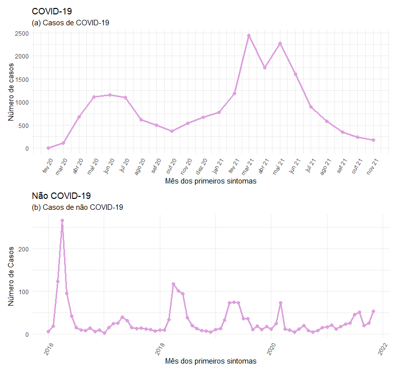
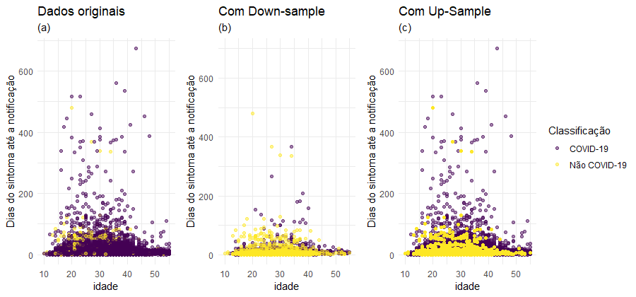
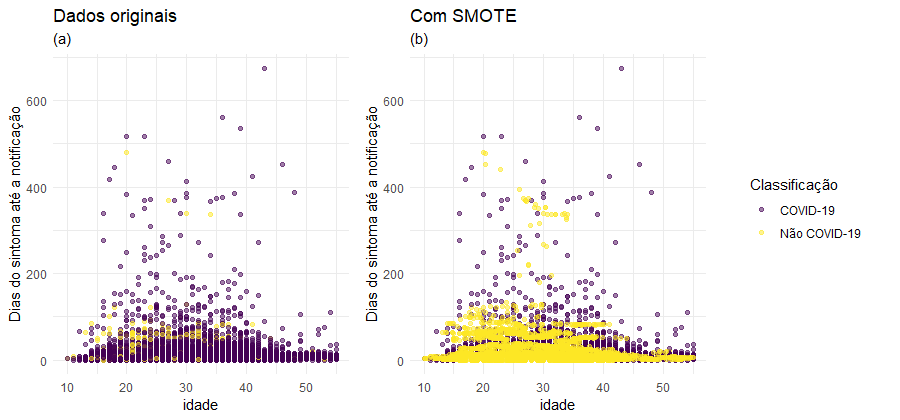
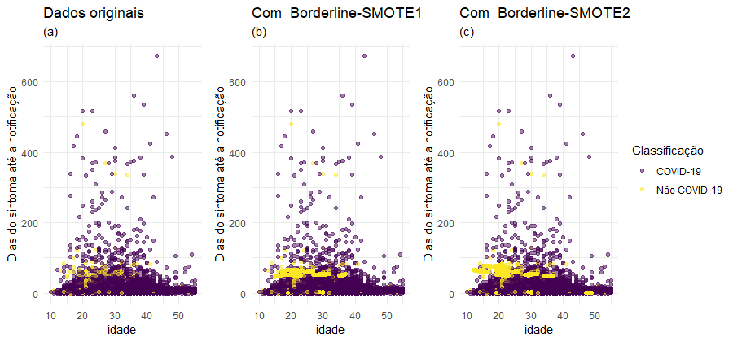
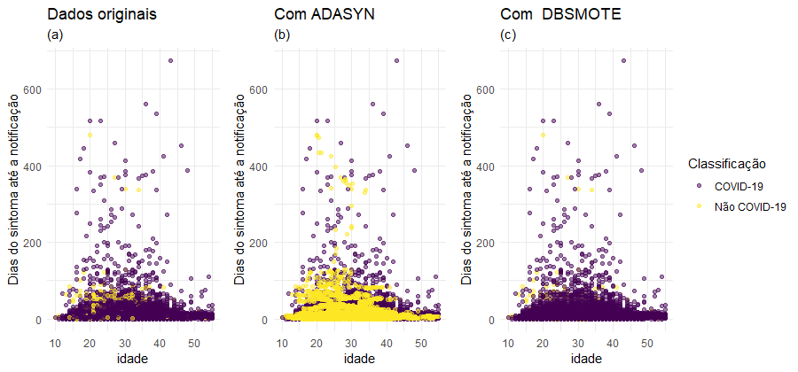
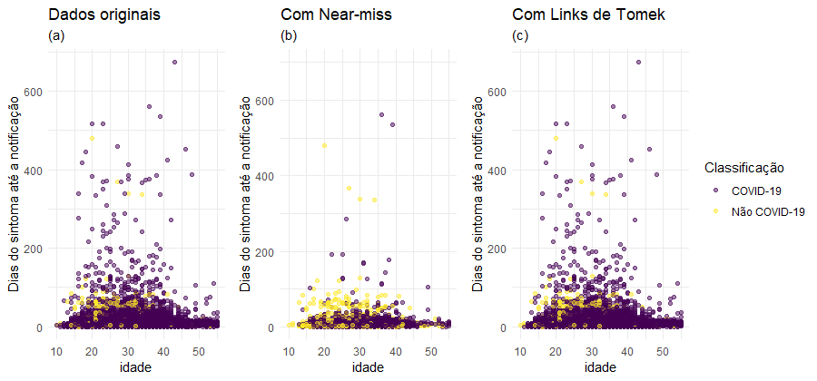
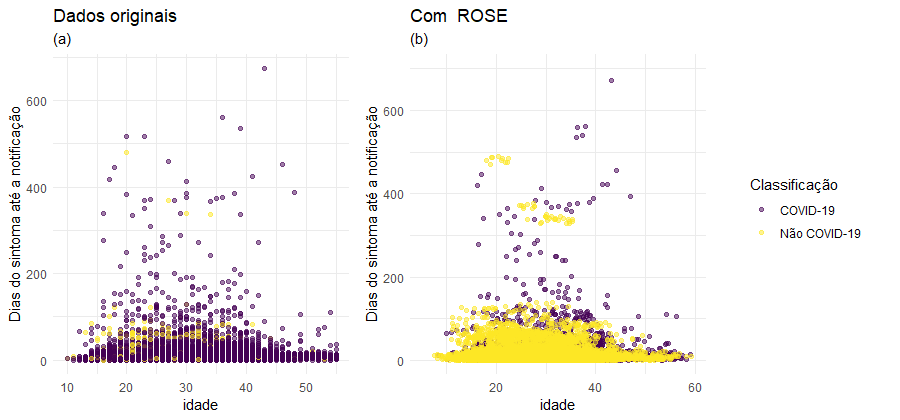

class: middle, inverse

# Métodos de reamostragem para dados desbalanceados: uma aplicação para classificação de COVID-19 na população materna

.large[##### Monografia I - 2022/1]
.large[#####Orientadora: Agatha Sacramento Rodrigues]
.large[#####Coorientadora: Luciana Graziela de Godoi]


### Elias Ribeiro Rosa Junior


```{r setup, include = FALSE}
options(htmltools.dir.version = FALSE)
```

```{r xaringan-themer, include = FALSE, warning = FALSE}
library(xaringanthemer)

style_mono_accent(
  base_color = "#1c5253",
  text_font_google = google_font("Lato", "300", "300i"),
  header_font_google = google_font("Antic")
)
```

---
class: middle, inverse

## Introdução

---
class: middle

### Introdução

- O uso de algoritmos de **Aprendizado de Máquina** tem sido cada vez mais frequentes devido à sua alta capacidade de lidar com armazenamento e processamento de grande volumes de dados.

- Entretanto, no mundo real, a modelagem de classificação pode se deparar com o problema de **dados desequilibrados**.

- Uma das abordagens que vem se tornando popular para resolver a problemática do
desbalanceamentos dos dados é sobreamostrar a classe minoritária ou subamostrar a classe
majoritária (Japkowicz, 2000). Entretanto, essas técnicas podem causar outro problema: o de sobreajuste

- Uma alternativa mais robusta de reamostragem foi proposta por (CHAWLA, 2002),
que é a de gerar dados sintéticos (ou artificiais). Essa alternativa foi chamada de **SMOTE**.

- Posteriormente, a técnica **SMOTE** foi adaptada nas técnicas **Boderline SMOTE** (HAN,2005), **ADASYN** (HE HAIBO, 2008) E **DBSMOTE** (Bunkhumpornpat, 2012).

---
class: middle

- Além desses métodos, existem as técnicas de subamostragem baseadas em algoritmos de aprendizado de máquina, como a **Links de Tomek** (Tomek, 1976) e **Near Miss** (Zhang and Mani, 2003) e a técnica **ROSE** (Menardi and Torelli, 2014), que realiza ao mesmo tempo subamostragem e sobreamostragem.

- Os métodos de reamostragem propostos, após discutidos e avaliados, serão utilizados em um problema de classificação com dados desbalanceados reais, o SIVEP-Gripe. Os dados contém informações de Síndromes Respiratórias Agudas Graves (SRAG), disponibilizados pelo Ministério da Saúde do Brasil no portal DATASUS.

- Evento de interesse: classificação do tipo de **SRAG COVID-19** em gestantes e puérperas.

- O grupo de indivíduos analisado será a de mulheres gestantes e puérperas,
bastante afetadas pela gravidade do novo coronavírus. Um estudo feito pelo Observatório Obstétrico Brasileiro, aponta que durante o primeiro ano pandêmico no Brasil, um aumento considerável de mortes de mulheres no ciclo gravídico-puerperal elevou a taxa de mortalidade materna em cerca de 20% (Francisco et al., 2021)

- Este trabalho utilizará os métodos de reamostragem para o problema do
desequilíbrio dos dados, uma vez que a frequência de casos de infecção pelo COVID-19 é
consideravelmente maior do que a soma do casos em que o agente etiológico não era o COVID-19. 

---
class: middle

### Objetivos

- Apresentar diferentes metodologias de reamostragem.

- Comparar essas metodologias via estudos de simulação.

- Reunir informações de pacotes e funções atualizadas no software R, que podem ser utilizadas para cada método específico, destacando suas diferenças, vantagens e desvantagens.

- Comparar a eficiência dos métodos em termos de medidas de desempenho e de interpreta0bilidade na fase de teste do modelo XGBoost.

- Indicar a metodologia de reamostragem que forneceu o melhor ajuste do modelo na fase
de treinamento. Usar esse modelo para classificar os casos não especificados de SRAG
durante a pandemia.


---
class: middle, inverse

## Materiais e Métodos

---
class: middle

### Os dados

- O banco de dados do SIVEP-Gripe foi criado em 2000 para monitorar e coletar infor-
mações sobre a circulação de vírus e síndromes respiratórias no Brasil.

- Casos hospitalizados.

- Em 2020, a rede implantou os dados sobre a COVID-19, infecção do novo Coronavírus, que causou uma nova pandemia ao redor do mundo.

- A base de dados contém a classificação final do indivíduo, que indica o diagnóstico final
do caso, informando qual é o tipo de SRAG. Os tipos são influenza, outro vírus respiratório,
outro agente etiológico, COVID-19 e também existe a classificação de SRAG não especificada.

- Os dados foram baixados em 17/08/2022.

---
class: middle
### Distância Euclidiana

- Baseada no teorema de Pitágoras, a **distância euclidiana** é a distância entre dois pontos. Num espaço vetorial de $n$ dimensões, a distância euclidiana entre um ponto $P=(p_1,p_2,\cdots,p_n)$ e $Q=(q_1,q_2,\cdots,q_n)$ é definida por: 
$$\sqrt{\sum^n_{i=1}(p_i-q_i)^2}.$$
---
class:middle
### Distância de Gower

- A **distância de Gower** é baseada no algoritmo de Gower (Gower, 1971), que pode ser usado para calcular a distância entre as variáveis de um banco de dados. O algoritmo analisa conjuntamente variáveis qualitativas e quantitativas de modo que os valores da matriz de distância estejam entre 0 e 1. A distância é definida por:
$$S_{ij}=\frac{\sum^p_{k=1}W_{ijk}S_{ijk}}{\sum^p_{k=1}W_{ijk}},$$
onde $k$ é o numero de variáveis, $p$ é o número total de características , $i$ e $j$ são duas observações quaisquer, $W_{ijk}$ é um peso dada a comparação $ijk$, atribuindo valor 1 para comparações válidas e valor 0 para comparações inválidas, $S_{ijk}$ é a contribuição da variável $k$ na similaridade entre as observações $i$ e $j$, possuindo valores entre 0 e 1. Para uma variável nominal, caso o valor de $k$ seja o mesmo para ambas as observações então $S_{ijk}$ é 1, caso contrário, é igual a 0. Para uma variável contínua, temos:
$$S_{ijk}=1-\frac{|x_{ik}-x_{jk}|}{R_k},$$
onde $x_{ik}$ e $x_{jk}$ são os valores da variavel $k$ para as observações $i$ e $j$, respectivamente, e $R_k$ é a amplitude de variação da variável $k$ na amostra.

---
class:middle

### Distância de Hamming Ou Overlap

- Criado em 1950 pelo engenherio R. W. Hamming, o método calcula a distância entre dois padrões considerando 0 se forem iguais, e 1 se forem diferentes. Num banco de dados, a
 **distância Overlap** entre duas variáveis  $P=(p_1,p_2,\cdots,p_n)$ e $Q=(q_1,q_2,\cdots,q_n)$ é definida por: 

$$D_O(p,q)=\sum^n_{k=1}\delta(p_k,q_k),$$

$$\delta(p_k,q_k)= \left\{\begin{matrix}
0 \,\ \text{se} \,\ p_k = q_k \\
1 \,\ \text{se} \,\ p_k\ \neq q_k.
\end{matrix}\right.$$
---
class: middle

### Distância HEOM 

- A **distância HEOM **(Heterogeneous Euclidian-overlap Metric) mescla a **Distância Euclidiana** com a **distância Overlap**, calculando as diferentes funções para seus tipos de atributos. Num banco de dados, a distância HEOM entre duas variáveis  $P=(p_1,p_2,\cdots,p_n)$ e $Q=(q_1,q_2,\cdots,q_n)$ é definida por: 
$$D_H(p,q)=\sqrt{\sum^n_{k=1}d_k(p_k,q_k)^2},$$
onde se o $k$-ésimo for nominal $d_k(p_k,q_k)^2$ é a distância Overlap  e se for numérico é a distância Euclidiana.

---
class: middle

### KNN

- O Algoritmo **KNN** também conhecido como método K-vizinhos mais próximos é um método de classificação não paramétrico simples, mas eficaz em muitos casos (Hand et al., 2001).

- fixe um valor para $k$ e uma observação de teste $x_0$.

- identifique os $k$-vizinhos mais próximos de $x_0$ segundo algum critério de distância, e crie um conjunto $W$ com esses pontos.

- estime a probabilidade condicional da observação $x_0$ pertencer à classe $c$, isto é, $P(Y_i=c|X=x_0)=\frac{1}{k}\sum_{i\in W} I(y_i=c)$.

- classifique $x_0$ com a classe que resultar em maior probabilidade.

---
class:middle
### *Bootstrap* suavizado

- O bootstrap introduzido por Efron em 1979, sua versão suavizada consiste em gerar m novas amostras a partir de sorteios com reposição da amostra original.

- Suponha que $X_1,X_2,\cdots,X_n$ seja uma amostra de distribuição contínua $F$ desconhecida com densidade $f$. O interesse é estimar uma nova população de interesse com um estimador bootstrap $\alpha(\hat{F})$, onde $\hat{F}$ é o valor impírico da distribuição $F_n$ ou sua versão suavizada. 
Seja $K$ uma função kernel simétrica tal que ela própria é uma função de densidade com variância unitária. O estimador de kernel padrão $\hat{f}_h(x)$ de $f(x)$ é dado por
$$\hat{f}_h(x)=\frac{1}{nh}\sum^n_{i=1}K\left(\frac{x-X_i}{h}\right),$$
onde $h$ é o parâmetro de suavização. A função de distribuição correspondente do estimador é $\hat{F}_h(x)=\int^x_{-\infty}\hat{f}_h(t)dt.$
---
class:middle, inverse
### Métodos de Reamostragem

---
class:middle

### Up-Sample

- Técnica de sobreamostragem aleatória. De maneira simples, ele realiza uma sobreamostragem da classe minoritária de forma aleatória com reposição, replicando linhas de um conjunto de dados para igualar a ocorrência das classes.

### Down-Sample

- Técnica de subamostragem aleatória. De maneira simples, elerealiza uma subamostragem da classe minoritária aleatória, removendo linhas de um conjunto de dados para igualar a ocorrência das classes.

---
class: middle

### Smote

- Proposta por Chawla, em 2002, a técnica **SMOTE** (*Synthetic Minority Over-sampling
Technique*) realiza uma sobreamostragem gerando dados sintéticos por meio de interpolação
linear.

- Ele utiliza o algoritmo **KNN** para identificar os $k$-vizinhos mais próximos das classes
minoritárias e introduz dados sintéticos ao longo dos segmentos que os unem.

```{r echo = FALSE, fig.align = 'center', out.width = "70%"}
knitr::include_graphics("imagens/smote_ilus.png")
```

---
class: middle

### SMOTE-NC 

- O **SMOTE-NC** (*Synthetic Minority Over-sampling Technique-Nominal Continuous*) é
uma técnica de sobreamostragem generalizada do Smote para lidar com dados categóricos e não
categóricos ao mesmo tempo.

- Chawla (2002) propõe utilizar distância euclidiana da mediana dos desvios padrões das características contínuas para penalizar a diferença de características nominais.

- Em 2021 foi criada por Cernuda a abordagem **GSMOTE** (*Generalized Synthetic Minority Oversampling Technique*). o **GSMOTE** calcula as distâncias dos $k$-vizinhos mais próximos por meio de uma transformação do **Coeficiente Geral de Similaridade de Gower**.

---
class: middle

### Borderline Smote

- Generalizada do método **SMOTE**, a técnica **Boderlie-SMOTE** considera apenas
as observações nas fronteiras entre as classes, reamostrando as observações da classe minoritária, que tem como k-vizinhos observações da classe minoritária e majoritária

- **Borderline-Smote1** : O método considera apenas os casos, onde o número de k-vizinhos
mais próximos da classe majoritária são maiores do que os da minoritária. Desconsiderando todos os outros.

- **Borderline-Smote2** : Considera também os casos onde os k-vizinhos mais próximos da classe minoritária sejam maiores. A diferença, é que no segundo caso, seguido pelo cálculo da distância euclidiana, a diferença dos pontos é multiplicado por um numero aleatório entre 0 e 0.5 e não 0 e 1.

- Uma desvatangem desse método, é que ele acaba dando mais atenção às observações entre as fronteiras.

- Posteriormente, outras abordagens foram desenvolvidas para lidar com a importância das informações nas fronteiras como também no restante dos dados, as técnicas **ADASYN** e **DBSMOTE**.

---
class: middle

### ADASYN

- O método tem como idéia principal utilizar uma distribuição ponderada no tipo observações minoritárias de acordo com sua complexidade para o aprendizado. Ele aplica maior peso às observações minoritárias que tem mais k-vizinhos próximos da classe majoritária, visto que esses são mais difíceis de classificar, e menos peso as outras observações

### DBSMOTE 

- Baseado em uma abordagem de agrupamento baseada em densidade chamada **DBSCAN** (ESTER, 1996).

- O **DBSMOTE** foi inspirado pelo **Borderline SMOTE**, sua diferença é que o método opera em regiões seguras,aquelas regiões onde as observações minoritária tem todos os $k$-vizinhos das classes minoritárias, melhorando assim as taxas de aprendizado de toda classe minoritária.

- O método também se assemelha ao **ADASYN**, porém ao invés de atribuir pesos as
observações da classe minoritária, a técnica as agrupam em clusters.

---
class: middle

### Near-miss

- Técnica de subamostragem baseada no algoritmo **Near-miss** que observa a distribuição de classes e elimina as observações da classe majoritária que possuem a menor distância média aos $k$-vizinhos mais próximos na outra classe, minoritária.

### Links de Tomek

- Técnica de subamostragem baseada no algoritmo **Links de Tomek** que consiste em remover observaçoes da classe majoritaria presente em pares de unidades amostrais, uma majoritária e outra minoritária, em que exista a menor distância euclidiana entre ambas.
---
class: middle

### ROSE

- Técnica de sobreamostragem dentro de um conjunto de dados para obter regras de classifica-
ção em dados desbalanceados.  Ele é estabelecido a partir da geração de novos dados artificiais das classes, de acordo com uma forma *bootstrap* suavizada.

- Diferente das outras técnicas de sobreamostragem e subamostragem apresentadas, **ROSE**
combina técnicas de sobreamostragem e subamostragem gerando novos dados artificiais tanto
para as classes majoritárias, quanto minoritárias.

---
class: middle, inverse

## Resultados Parciais
---
class:middle

### Análise exploratória dos dados

- Os dados foram tratados e filtrados de forma que contivessem apenas informações adequadas de gestantes e puérperas, isto é, sexo feminino e idade entre 10 e 55 anos.

- Dos 38.877 registros, 1.521 (3,9%) foram classificados como **SRAG por Influenza**, 601 (1,5%) como **SRAG outros vírus respiratórios**, 108 (0,3%) como **SRAG por outro agente etiológico**, 16.408 (41,3%) como **SRAG não especificada**, 19.136 (49.2%) como **SRAG por COVID-19** e 1.463 (3,7%) como observações em branco e ignorada.

- Fez-se a junção de SRAG por influenza, outros vírus respiratórios e outros agentes etiológicos em uma categoria, com o nome de não COVID-19. Selecionando apenas os casos de COVID-19 e não COVID-19, a base de dados, por fim, registra 21.366 observações, sendo 19.136 (89.6%) SRAG por **COVID-19** e 2.230 (10.4%) por **não COVID-19**.
---
class: middle

- Distribuição de casos de COVID-19 e não COVID-19 por estado.

```{r echo = FALSE, fig.align = 'center', out.width = "80%"}

```

---
class: middle

- Distribuição de casos de COVID-19 e não COVID-19 pelo tempo.

```{r echo = FALSE, fig.align = 'center', out.width = "70%"}

```
---
class: middle

- Variáveis idade e tempo entre a data dos sintomas até a data de notificação.

```{r,echo=FALSE,out.width = "70%"}
readRDS("datasum1.rds")
readRDS("datasum2.rds")
```

- Realizado Teste T, e em abos foi rejeitado a hipótese nula de igualdade entre as médias dos grupos COVID-19 e não COVID-19.
---
class: middle, inverse

## Reamostragem dos dados com variáveis contínuas
---
class: middle

- Como a maioria dos métodos propostos são baseados em técnicas que consideram covariáveis não categóricas, para efeito de exemplicação vamos considerar apenas as variáveis idade e tempo decorrido entre os primeiros sintomas até a notificação.

- Para aplicação dos métodos **Down-Sample**, **Up-Sample**, **SMOTE**, **Borderline-SMOTE1**, **Borderline-SMOTE2**, **ADASYN** e **Near-miss** foi considerado o pacote *themis*. Para o método **DBSMOTE**, foi considerado o pacote *smotefamily*, que também tem os métodos **SMOTE**, **Borderline-SMOTE1**, **Borderline-SMOTE2** e **Adasyn**. Por fim, para aplicação do método **Links de Tomek **foi utilizado o pacote *UBL*, que também realiza os métodos **SMOTE** e **ADASYN**.

---
class: middle

- **Down-sample** e **Up-sample**

```{r echo = FALSE, fig.align = 'center'}

```

---
class: middle
- **SMOTE**

```{r echo = FALSE, fig.align = 'center'}

```

---
class: middle

- **Borderline SMOTE**

```{r echo = FALSE, fig.align = 'center'}

```

---
class: middle

- **ADASYN** e **DBSMOTE**

```{r echo = FALSE, fig.align = 'center'}

```

---
class: middle

- **Near-miss** e **Links de Tomek**

```{r echo = FALSE, fig.align = 'center'}

```

---
class: middle

- **ROSE**

```{r echo = FALSE, fig.align = 'center'}

```

---
class: middle, inverse

## Cronograma
---
class: middle

- Apresentar de forma detalhada os algoritmos utilizados no processo de reamostragem. Mês: **09/2022**.
- Acrescentar metodologias mais complexas utilizadas a alguns métodos de reamostragem, como **DBSCAN** no **DSBMOTE** e **Entropia Variável** no **SMOTE-NC** . Meses: **09 a 10/2022**.
- Como diferentes metodologias de reamostragem são aplicadas a variáveis de mesma natureza, realizar um estudo de simulação de forma a indicar qual seria a metodologia ótima. Adicionalmente, como muitas das metodologias estão implementadas em diferentes pacotes no R, comparar o desempenho dos pacotes. Meses: **10 a 11/2022**.
- Aplicar os métodos **ADASYN**, **SMOTE** e **Links de Tomek** com dados categóricos através do pacote "UBL", o mesmo disponibiliza trocar a forma de cálculo entre as distâncias dos dados de forma categórica, usando a **distância Overlap** ou **HEOM**. Mês: **11/2022**.
- Considerando todas as covariáveis do banco de dados, aplicar as diferentes metodologias de reamostragem citadas no Item 4, incluso análise com o **SMOTE-NC**, na fase de treinamento do modelo **XGBoost**. Comparar a eficiência dos métodos em termos de medidas de desempenho e de interpretabilidade na fase de teste do modelo. Mês: **12/2022**.
- Indicar a metodologia de reamostragem que forneceu o melhor ajuste do modelo na fase treinamento. Usar esse modelo para classificar os casos não especificados de SRAG durante a pandemia. Mês: **01/2023**.

---
class: middle, center, inverse

# Obrigado!
